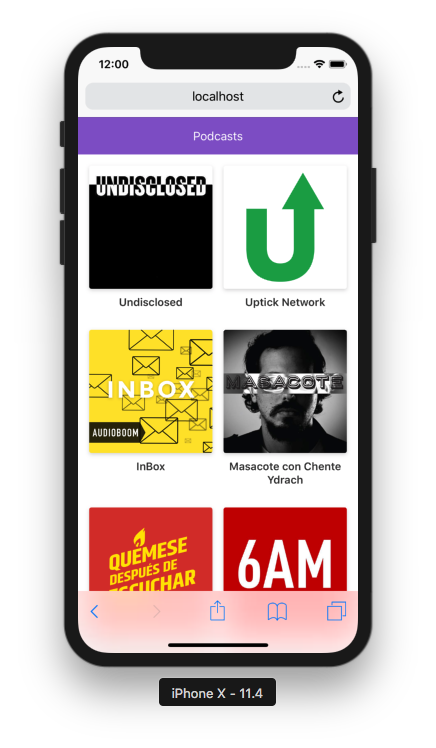

# Curso de Next.JS en Platzi

App de Podcasts integrada con la API de AudioBoom para aprender Next.JS

## ¿Como funciona?

Requiere Node.js 10

*`npm install` para instalar las dependencias
*`npm run dev` para levantar entorno de desarrollo
*`npm run build && npm start` para levantar entorno de producción

#Licencia
MIT